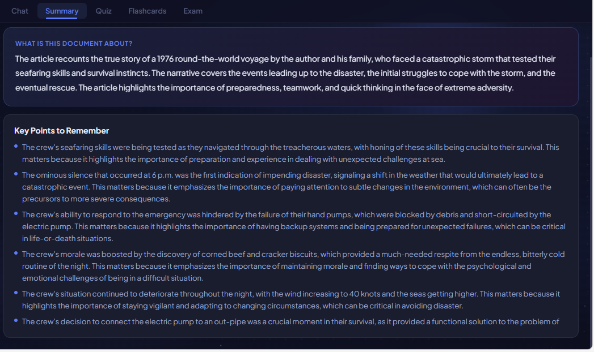
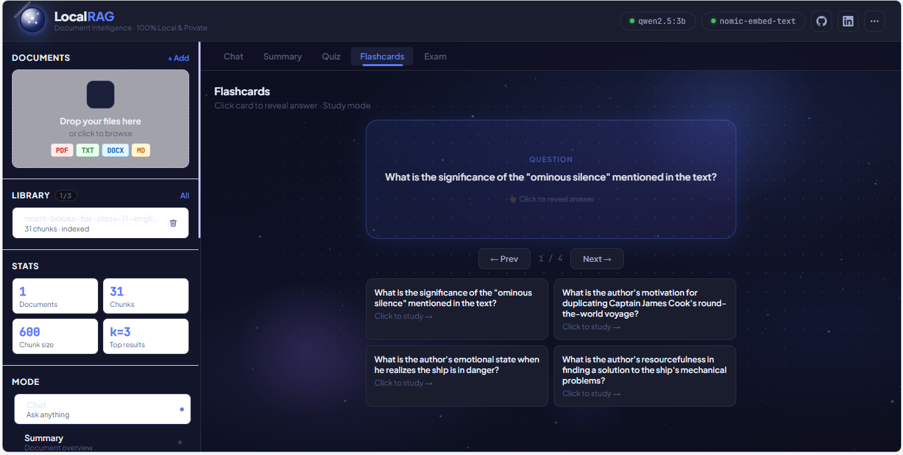

<div align="center">

<svg xmlns="http://www.w3.org/2000/svg" width="110" height="110" viewBox="0 0 120 120" overflow="visible">
  <defs>
    <radialGradient id="logoBg" cx="50%" cy="50%" r="50%">
      <stop offset="0%" stop-color="#1e2a5e"/>
      <stop offset="100%" stop-color="#080e2a"/>
    </radialGradient>
    <radialGradient id="logoGl" cx="32%" cy="28%" r="65%">
      <stop offset="0%" stop-color="#fff" stop-opacity="1"/>
      <stop offset="35%" stop-color="#e8eeff" stop-opacity=".9"/>
      <stop offset="100%" stop-color="#3b5bdb" stop-opacity=".2"/>
    </radialGradient>
    <clipPath id="logoClip"><circle cx="60" cy="60" r="50"/></clipPath>
    <filter id="glow" x="-50%" y="-50%" width="200%" height="200%">
      <feGaussianBlur stdDeviation="3" result="blur"/>
      <feMerge><feMergeNode in="blur"/><feMergeNode in="SourceGraphic"/></feMerge>
    </filter>
  </defs>
  <circle cx="60" cy="60" r="58" fill="none" stroke="#3b5bdb" stroke-width="0.7" opacity="0.3"/>
  <ellipse cx="60" cy="60" rx="52" ry="14" fill="none" stroke="#5c7cfa" stroke-width="0.9" opacity="0.35"/>
  <circle cx="60" cy="60" r="54" fill="url(#logoBg)"/>
  <circle cx="60" cy="60" r="50" fill="url(#logoGl)" opacity="0.88"/>
  <g clip-path="url(#logoClip)" stroke="white" stroke-width="1.2" opacity="0.35">
    <line x1="36" y1="38" x2="60" y2="53"/>
    <line x1="60" y1="53" x2="84" y2="34"/>
    <line x1="60" y1="53" x2="76" y2="73"/>
    <line x1="36" y1="38" x2="46" y2="70"/>
    <line x1="46" y1="70" x2="76" y2="73"/>
  </g>
  <g clip-path="url(#logoClip)" filter="url(#glow)">
    <circle cx="60" cy="53" r="6" fill="white"/>
    <circle cx="36" cy="38" r="3.5" fill="white" opacity="0.9"/>
    <circle cx="84" cy="34" r="3" fill="white" opacity="0.85"/>
    <circle cx="46" cy="70" r="3.5" fill="white" opacity="0.9"/>
    <circle cx="76" cy="73" r="4" fill="white" opacity="0.9"/>
  </g>
  <ellipse cx="44" cy="37" rx="12" ry="8" fill="white" opacity="0.15" transform="rotate(-30 44 37)"/>
</svg>

# LocalRAG

**Document Intelligence · 100% Local & Private**

[](https://python.org)
[](https://flask.palletsprojects.com)
[](https://ollama.com/library/llama3.2)
[](https://ollama.com/library/nomic-embed-text)
[](LICENSE)

Ask questions about your documents. Get AI answers in ~5–7 seconds.
No cloud. No subscription. No internet after first setup.

[🌐 **Website**](https://aimlwithbobbybalyan.github.io/Local-RAG-system) · [📖 **Docs**](#installation)

</div>

---

## What is LocalRAG?

LocalRAG is a 100% offline AI study assistant built on top of [Ollama](https://ollama.com). Upload a document and instantly get:

- **Chat** — ask questions, get answers with source citations
- **Summary** — structured overview, key points, important terms
- **Quiz** — auto-generated MCQ with explanations
- **Flashcards** — flip-card study mode, key concepts
- **Exam** — timed, scored, Easy / Medium / Hard difficulty

Everything runs entirely on your machine. The LLM (`llama3.2:3b`) and embedding model (`nomic-embed-text`) run locally via Ollama. Your documents never leave your computer.

---

## Screenshots

| Chat | Summary |
|------|---------|
|  |  |

| Quiz | Flashcards |
|------|-----------|
|  |  |

---

## Features

| Feature | Detail |
|---------|--------|
| 💬 **Chat** | BM25 hybrid retrieval + ChromaDB vector search. Returns cited sources (filename + page number). |
| 📝 **Summary** | Title, overview, and up to 6 key points — pre-generated in background after upload. |
| 🧠 **Quiz** | Up to 8 deduplicated MCQ questions with 4 options each and explanations. |
| 🃏 **Flashcards** | Up to 8 Q&A flip-cards extracted from your document. |
| 📋 **Exam** | Unlimited questions sorted Easy → Medium → Hard, auto-scored with feedback. |
| ⚡ **Token Streaming** | Chat answers stream in real-time via Server-Sent Events (SSE). |
| 🔄 **Background Pre-gen** | 5 LLM calls run in a background thread after upload so all tabs load instantly. |
| 📂 **Multi-document** | Up to 3 documents loaded simultaneously. Filter chat by specific file. |
| 🗑️ **Delete & Re-index** | Delete individual documents; index rebuilds automatically. |
| 🔒 **100% Private** | No data leaves your machine. No API keys. No accounts. No telemetry. |

---

## Performance

This project went from **8+ minutes per response → ~5–7 seconds** through 8 rounds of optimisation, all on budget CPU hardware with no GPU.

### Optimisations applied

| What changed | Before | After |
|---|---|---|
| `num_predict` (token limit) | 900 | **350** |
| `num_ctx` (context window) | default | **2048** |
| Context fed to model | full document | **2000 chars sampled** |
| LLM instantiation | per request | **singleton (created once)** |
| QA chain | rebuilt each call | **cached by filter key** |
| Pre-generation LLM calls | 9 serial | **5 (background thread)** |
| BM25 retrieval | ❌ | **✅** |
| Text cache | ❌ | **✅ (invalidated on new upload)** |

### Expected performance by hardware

> Tested on `llama3.2:3b` + `nomic-embed-text` · CPU-only inference via Ollama

| Hardware | RAM | GPU | Chat (cached) | Chat (cold) | Pre-gen (background) |
|---|---|---|---|---|---|
| AMD Ryzen 3 *(dev machine)* | 8 GB | None | **5–7s** | ~25–35s | ~3–5 min |
| Intel Core i5 (8th gen+) | 8 GB | None | ~4–6s | ~20–30s | ~2–4 min |
| Intel Core i7 / Ryzen 5 | 16 GB | None | ~3–5s | ~15–25s | ~1.5–3 min |
| Any CPU | 16 GB | NVIDIA (CUDA) | ~1–2s | ~5–10s | ~30–60s |
| Any CPU | 16 GB | AMD (ROCm) | ~2–3s | ~8–15s | ~1–2 min |

> ℹ️ Cold start = first query after launch (model loads into RAM). Cached = subsequent queries on same document.

### Built on

| Component | Spec |
|---|---|
| CPU | AMD Ryzen 3 |
| RAM | 8 GB |
| GPU | None (CPU-only) |
| OS | Windows 10 |
| LLM | llama3.2:3b |
| Embed model | nomic-embed-text |
| Cost per query | ₹0 |

---

## Tech Stack

```
Backend         Python 3.10+ · Flask · flask-cors
LLM             llama3.2:3b via Ollama  (temperature=0.2, num_predict=350, num_ctx=2048)
Embeddings      nomic-embed-text via Ollama
RAG             LangChain · ChromaDB (chroma_db/)  ·  BM25 hybrid retrieval
Chunking        chunk_size=600  ·  chunk_overlap=80
Streaming       Server-Sent Events (SSE)  ·  Flask stream_with_context
File support    .pdf  ·  .docx  ·  .txt  ·  .md
File limits     Max 3 documents  ·  Max 50 MB per file
Frontend        Vanilla HTML · CSS · JavaScript (no framework)
```

---

## Installation

### Requirements

- Windows 10 or 11 (64-bit)
- Python 3.10+
- 8 GB RAM minimum
- ~5 GB free disk space
- Internet for first run only (to download models)

### Step-by-step

**1. Clone the repository**
```bash
git clone https://github.com/aimlwithbobbybalyan/Local-RAG-system.git
cd Local-RAG-system
```

**2. Install Python dependencies**
```bash
pip install -r requirements.txt
```

**3. Install Ollama**

Download and install from [ollama.com](https://ollama.com). Make sure it's running before starting the app.

**4. Pull the AI models** *(one-time, ~2.3 GB total)*
```bash
ollama pull llama3.2:3b
ollama pull nomic-embed-text
```

**5. Run the app**
```bash
python app.py
```

**6. Open in your browser**
```
http://localhost:5000
```

---

## Usage

1. **Upload** a `.pdf`, `.docx`, `.txt`, or `.md` file via the sidebar (max 50 MB, up to 3 files)
2. **Wait** a few seconds — the app indexes the document and starts pre-generating study materials in the background (5 LLM calls)
3. **Chat tab** — type any question; answers stream in real-time with source citations (filename + page)
4. **Summary tab** — instant once background generation completes
5. **Quiz / Flashcards / Exam tabs** — all served instantly from cache

---

## Project Structure

```
Local-RAG-system/
├── app.py               # Flask server · all routes · SSE streaming · pre-gen cache
├── rag_pipeline.py      # LangChain RAG · ChromaDB · BM25 · chunk_size=600
├── prompts.py           # LLM prompt templates (summary, keypoints, quiz, flashcards, exam)
├── benchmark.py         # Performance benchmarking against real uploaded documents
├── requirements.txt
├── templates/
│   └── index.html       # Main UI (single page app)
├── static/
│   ├── style.css        # All styles · dark mode · animations
│   └── script.js        # UI logic · streaming · flashcard flip
├── data/                # Uploaded documents  [gitignored]
├── chroma_db/           # ChromaDB vector index  [gitignored]
└── screenshots/
```

---

## API Routes

| Method | Route | Description |
|--------|-------|-------------|
| `GET` | `/` | Serve the UI |
| `POST` | `/upload` | Upload and index a document |
| `GET` | `/documents` | List indexed documents with size |
| `DELETE` | `/document/<filename>` | Delete a document and re-index |
| `POST` | `/chat` | Non-streaming chat |
| `POST` | `/chat/stream` | Streaming chat via SSE |
| `POST` | `/summary` | Summary (cached after upload) |
| `POST` | `/quiz` | Quiz questions (cached after upload) |
| `POST` | `/flashcards` | Flashcards (cached after upload) |
| `POST` | `/exam` | Exam questions (cached after upload) |
| `GET` | `/status` | Ollama status · index info · chunk count |
| `GET` | `/cache/status` | Which features are pre-generated |
| `DELETE` | `/index` | Wipe the entire ChromaDB index |

---

## Privacy

- ✅ All inference runs **on your CPU** via Ollama — no external API calls ever
- ✅ Documents stored **locally** in `./data/`
- ✅ Vector index stored **locally** in `./chroma_db/`
- ✅ **No telemetry**, no analytics, no accounts, no sign-up
- ✅ **Open source** — every line is on GitHub, nothing hidden

---

## Benchmarking

First upload at least one document via the UI, then run:

```bash
python benchmark.py
```

Tests chat response time, summary, quiz, and flashcard generation against your real uploaded document. All results printed to terminal.

---

## Contributing

PRs welcome. For major changes, open an issue first.

```bash
git checkout -b feature/your-feature-name
# make your changes
git push origin feature/your-feature-name
# open a Pull Request
```

---

## About

Built by **Bobby Balyan** — CS student at CT Group of Institutions, Ludhiana.

Started as a college project with one question: *can you get useful AI study tools running on a Ryzen 3 with 8GB RAM and no GPU?* Turns out yes — but it takes 8 rounds of profiling to get from 8 minutes to 5–7 seconds.

📧 bobby.2301385@stu.ctgroup.in  
🐙 [github.com/aimlwithbobbybalyan](https://github.com/aimlwithbobbybalyan)

---

## License

MIT — see [LICENSE](LICENSE).

---

<div align="center">
  <sub>LocalRAG v2.1 · Built with ❤️ · College Project 2025</sub>
</div>